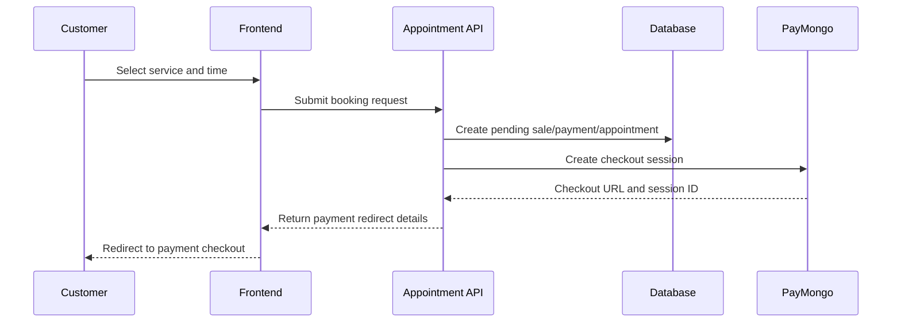

# User and Booking Flows

## 1. Public Visitor Flow

1. A visitor opens the landing page.
2. The app displays services, about information, contact details, and the chatbot entry point.
3. The visitor can browse services and navigate to sign-up or booking pages.

## 2. Registration Flow

1. The user submits first name, last name, email, password, and mobile number.
2. The frontend calls the sign-up action in src/app/signUp/actions.ts.
3. The app creates a Supabase Auth user and then calls the registration API.
4. The registration API uses src/lib/register-user.ts to create or update the corresponding Prisma User and Customer records.
5. A loyalty card is created for the customer automatically.

## 3. Login and Protected Routes

1. The user signs in through the Supabase client.
2. Middleware checks whether the requested route is protected.
3. If the user is not authenticated and the route requires access, the browser is redirected to /login.

Protected routes include:

- /appointment
- /reviews
- /myAppointments
- /myReviews
- /loyaltyCard
- /profile

## 4. Booking Flow

1. The customer selects a service and barber availability.
2. The client sends the booking request to the appointment confirmation API.
3. The API validates the requested time and service availability.
4. A pending sale, payment, and appointment are created in a transaction.
5. The app generates a PayMongo checkout session for the downpayment.
6. The customer completes the payment externally.
7. The appointment status and payment status are updated based on the callback or polling endpoint.

## 5. Appointment Reminder Flow

1. A scheduled cron endpoint is called with a shared secret.
2. The app finds appointments scheduled in the next hour that have not yet been reminded.
3. The system sends email reminders through Resend.
4. The appointment record is marked as reminded after a successful send.

## 6. Admin Flow

Admins can manage:

- services and pricing
- staff and barber schedules
- appointments and sales
- loyalty rules and card status
- reviews and reports
- chatbot settings and security logs

These operations are exposed through admin-specific route handlers and pages, usually guarded by an admin user role check.

## 7. Review and Loyalty Flow

- Customers can submit reviews after appointments or sales.
- Loyalty activity is recorded when a customer makes purchases or redeems rewards.
- Admin users can review or moderate content and adjust loyalty card settings.
