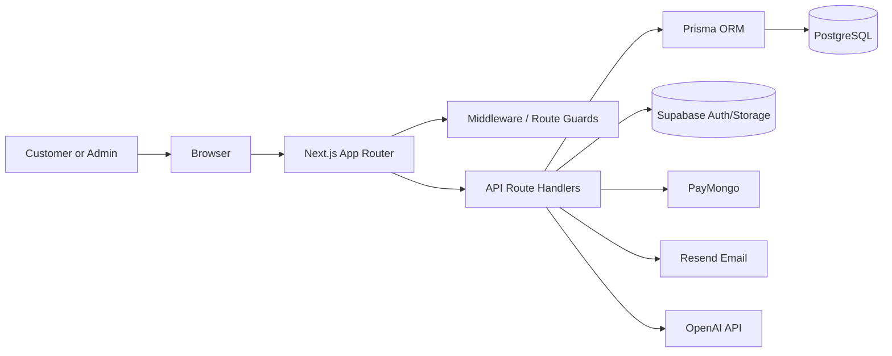

# System Architecture

## 1. Purpose

EstiloMo is a full-stack web application for managing a barbershop's customer-facing booking flow and internal operations. The current implementation is centered around a Next.js frontend that serves both customer pages and admin pages through the same application runtime.

## 2. Architectural Style

The system follows a modular monolith pattern implemented as a single Next.js application:

- the UI is rendered by React components in the App Router
- business logic lives in route handlers under src/app/api
- persistence is handled through Prisma and PostgreSQL
- authentication is handled with Supabase Auth
- external services are integrated through dedicated API calls

## 3. Main Components

### Presentation Layer

- App Router pages under src/app
- Shared UI under src/components and src/sections
- Theme and global providers under src/app/providers.tsx

### API Layer

- Route handlers under src/app/api
- These endpoints manage auth, registration, appointments, payments, admin operations, loyalty, reviews, and cron jobs

### Data Layer

- Prisma schema in prisma/schema.prisma
- Prisma client configured in src/lib/db.ts and src/lib/prisma.ts
- PostgreSQL database with tables for users, customers, barbers, services, appointments, sales, payments, loyalty, reviews, and security logs

### Auth and Identity

- Supabase Auth is used for login, sign-up, password reset, and session management
- Middleware in middleware.ts protects customer account routes
- Server-side Supabase clients are created in src/lib/supabase/server.ts

### External Integrations

- PayMongo for booking downpayment checkout
- Resend for email notifications
- OpenAI for admin reporting/chat features
- Supabase Storage for uploads
- Twilio is included in the dependency stack but is currently commented out in the reminder flow

## 4. Runtime Architecture

## 5. Core Domain Model

### Customer-facing entities

- User
- Customer
- Service
- Appointment
- Sale
- Payment
- LoyaltyCard
- Review

### Staff and operations entities

- Barber
- BarberSchedule
- BarberAbsent
- AppointmentSetting
- SecurityLog
- ChatbotSetting

## 6. Deployment Architecture

The app is containerized with Docker and deployed via Google Cloud Build and Cloud Run.

- Dockerfile builds the Next.js app and runs Prisma migrations on startup
- cloudbuild.yaml performs validation, image build, push to Artifact Registry, and deployment to Cloud Run
- environment variables are passed as build-time and runtime substitutions

## 7. Design Notes

- The system prioritizes a single deployment unit for faster iteration and simpler operations
- The API layer is tightly coupled with the frontend, which is appropriate for this project size
- Auth and database concerns are deliberately separated to support future scaling
- The booking flow is transaction-aware, especially around appointment creation and payment state changes
